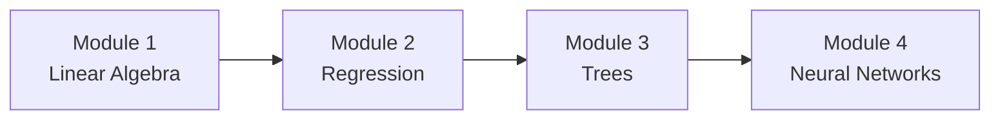

# Learning Path

This guide provides recommendations for how to approach ML101 to get the most out of your learning experience.

## Recommended Study Sequence

### Follow the Module Order

The modules are designed to build on each other:



!!! tip "Sequential Learning"
    Each module assumes knowledge from previous modules. Skipping ahead may result in missing important foundational concepts.

## Study Approach

### For Each Module

#### 1. Read the Module Overview (15 minutes)
- Understand what you'll learn
- Review prerequisites
- Set expectations for time commitment

#### 2. Complete Each Lesson (30-45 minutes per lesson)
- Read the lesson carefully on this documentation site
- Take notes on key concepts
- Run any inline code examples
- Ensure you understand before moving on

#### 3. Work Through Exercises (1-2 hours per exercise)
- Open the exercise notebook in Jupyter Lab
- **Attempt exercises independently first**
- Use hints only when stuck
- Don't rush - understanding is more important than speed

#### 4. Review Solutions (30 minutes per exercise)
- Compare your solution with the provided one
- Note any differences in approach
- Understand why the solution works
- Learn alternative methods

#### 5. Experiment and Explore (30-60 minutes)
- Modify parameters and observe effects
- Try different inputs
- Test edge cases
- Answer reflection questions

#### 6. Take Breaks
- Step away after completing an exercise
- Let concepts sink in
- Return refreshed for the next topic

## Time Commitment

### Estimated Time per Module

| Module | Lessons | Exercises | Total Time |
|--------|---------|-----------|------------|
| Module 1: Linear Algebra | 2-3 hours | 2-3 hours | **4-6 hours** |
| Module 2: Regression | 3-4 hours | 3-4 hours | **6-8 hours** |
| Module 3: Trees | 3-4 hours | 3-4 hours | **6-8 hours** |
| Module 4: Neural Networks | 4-5 hours | 4-5 hours | **8-10 hours** |

**Total Course:** 24-32 hours

### Recommended Pace

Choose a pace that works for you:

**Intensive (2-3 weeks):**
- Study 10-15 hours per week
- Complete 1-2 lessons per day
- Full module per week

**Moderate (1-2 months):**
- Study 5-8 hours per week
- Complete 2-3 lessons per week
- One module every 2 weeks

**Relaxed (2-3 months):**
- Study 2-4 hours per week
- Complete 1 lesson per week
- One module per month

!!! info "Quality Over Speed"
    It's better to deeply understand one concept than to rush through many. Take your time!

## Learning Strategies

### Active Learning

**Don't Just Read - Do:**
- Type out code examples (don't copy-paste)
- Predict output before running cells
- Explain concepts aloud or in writing
- Create your own examples

### Incremental Understanding

**Build Layer by Layer:**
- Master basics before advanced topics
- Revisit earlier material when needed
- Connect new concepts to what you know
- Look for patterns across modules

### Practical Application

**Think About Real Use Cases:**
- How would you use this at work?
- What problems could this solve?
- Where have you seen this in action?
- Can you apply this to your own data?

## Tips for Success

### When You're Stuck

1. **Re-read the lesson** - The answer is often there
2. **Check the hints** - They provide helpful direction
3. **Search online** - Stack Overflow, documentation, tutorials
4. **Take a break** - Fresh perspective often helps
5. **Review prerequisites** - Make sure fundamentals are solid
6. **Ask for help** - Open an issue on GitHub

### Effective Note-Taking

Keep a learning journal:
- **Key concepts:** What are the main ideas?
- **Examples:** Concrete instances of concepts
- **Questions:** Things you don't understand yet
- **Applications:** Where could you use this?
- **Connections:** How does this relate to other topics?

### Code Organization

As you work through exercises:
- **Comment your code:** Explain your reasoning
- **Use meaningful variable names:** `learning_rate` not `lr`
- **Test incrementally:** Run cells frequently
- **Save your work:** Notebooks save automatically, but save manually too
- **Experiment in copies:** Duplicate notebooks before major changes

## Dealing with Challenges

### Concept Is Confusing

- Break it into smaller pieces
- Draw diagrams or flowcharts
- Find alternative explanations online
- Implement a simple version first
- Discuss with others (forums, study groups)

### Math Is Intimidating

- Focus on intuition first, formulas second
- Use visualizations
- Relate to concrete examples
- Check the [Math Primer](resources/math-primer.md)
- Remember: understanding > memorization

### Code Isn't Working

1. Read the error message carefully
2. Check for typos
3. Verify data types and shapes
4. Print intermediate values
5. Simplify to smallest failing case
6. Compare with working examples

### Losing Motivation

- Review what you've already learned (you've made progress!)
- Set small, achievable goals
- Join a study group or find an accountability partner
- Take a day off and come back fresh
- Remember your "why" - why did you start?

## Beyond the Course

### After Completing ML101

**Practice More:**
- Kaggle competitions (start with Getting Started competitions)
- Personal projects with your own data
- Contribute to open-source ML projects

**Deepen Knowledge:**
- Implement papers from scratch
- Take advanced courses (Deep Learning Specialization, Fast.ai)
- Read ML textbooks (Pattern Recognition and Machine Learning, Deep Learning Book)

**Build a Portfolio:**
- Document your projects on GitHub
- Write blog posts explaining concepts
- Create visualizations and tutorials
- Share on LinkedIn or personal website

**Stay Current:**
- Follow ML researchers on Twitter/X
- Read papers on ArXiv
- Listen to ML podcasts (TWiML, The Batch)
- Attend local ML meetups or conferences

## Study Group Recommendations

Learning with others can be highly effective:

**Weekly Study Group:**
- Meet weekly to discuss a module
- Work through exercises together
- Explain concepts to each other
- Share different approaches

**Online Communities:**
- Reddit: r/MachineLearning, r/learnmachinelearning
- Discord servers for ML learners
- Twitter/X ML community
- LinkedIn ML groups

**Teaching Others:**
- Start a blog about your learning
- Create YouTube videos explaining concepts
- Mentor beginners once you've progressed
- Answer questions on Stack Overflow

!!! quote "The Feynman Technique"
    "If you can't explain it simply, you don't understand it well enough." Teaching is one of the best ways to learn.

## Module-Specific Tips

### Module 1: Linear Algebra
- **Visualize everything:** Use matplotlib to plot vectors and matrices
- **Connect to geometry:** Think about transformations visually
- **Practice by hand first:** Do small examples manually before coding
- **Use NumPy broadcasting:** Learn how it works early

### Module 2: Regression
- **Plot your data:** Always visualize before modeling
- **Watch gradient descent:** Animate the optimization process
- **Experiment with learning rates:** See what happens when too high/low
- **Understand overfitting:** This concept appears everywhere

### Module 3: Trees
- **Visualize trees:** Use sklearn's tree plotting
- **Compare algorithms:** See how different models perform
- **Feature importance:** Understand what drives predictions
- **Try hyperparameter tuning:** See the impact of different settings

### Module 4: Neural Networks
- **Start simple:** Single neuron before complex architectures
- **Implement from scratch first:** Don't jump to PyTorch immediately
- **Understand dimensions:** Print shapes constantly
- **Monitor training:** Watch loss curves, check for overfitting

## Assessment and Progress Tracking

### Self-Assessment

After each module, ask yourself:
- [ ] Can I explain key concepts without notes?
- [ ] Did I complete all exercises?
- [ ] Do I understand the solutions?
- [ ] Can I modify code for different scenarios?
- [ ] Could I teach this to someone else?

### Keep a Progress Log

Track your journey:
```markdown
## Week 1
- Completed Module 1 Lessons 1-2
- Struggled with eigenvalues but figured it out
- Need to review matrix multiplication

## Week 2
- Finished Module 1
- PCA exercise was challenging but rewarding
- Ready for Module 2
```

## Resources for Different Learning Styles

### Visual Learners
- Watch 3Blue1Brown videos on linear algebra and neural networks
- Create mind maps of concepts
- Use plotting extensively in notebooks
- Draw architectures and data flows

### Auditory Learners
- Explain concepts aloud
- Use text-to-speech for reading lessons
- Join study group discussions
- Listen to ML podcasts

### Kinesthetic Learners
- Type all code (no copy-paste)
- Build physical models of concepts
- Take breaks to move around
- Implement variations of exercises

### Reading/Writing Learners
- Take detailed notes
- Write blog posts about concepts
- Create cheat sheets
- Annotate code extensively

## Final Advice

### Remember These Principles

1. **Consistency > Intensity:** 30 minutes daily beats 3 hours once a week
2. **Understanding > Speed:** Deep learning takes time
3. **Practice > Theory:** Build things to cement knowledge
4. **Questions > Answers:** Asking good questions drives learning
5. **Progress > Perfection:** You'll make mistakes - that's how you learn

### You've Got This!

Machine learning can seem overwhelming at first, but with consistent effort and the right approach, you'll be amazed at how much you can learn. Thousands of people have successfully taught themselves ML, and you can too.

Ready to start?

[Begin Module 1](module1-linear-algebra/index.md){ .md-button .md-button--primary }

---

**Questions about the learning path?** Open an issue on [GitHub](https://github.com/jumpingsphinx/ML101/issues).
